# Application Flow & Technical Architecture
# The Shopkeeper - AI Shopping Assistant Platform

**Document Version:** 1.0  
**Team:** AgentX  
**Last Updated:** February 13, 2026  
**Purpose:** Complete technical flow documentation for developers and judges

---

## Table of Contents

1. [System Overview](#1-system-overview)
2. [High-Level Architecture](#2-high-level-architecture)
3. [User Flow Journeys](#3-user-flow-journeys)
4. [Technical Flow Diagrams](#4-technical-flow-diagrams)
5. [Database & Data Flow](#5-database--data-flow)
6. [API Specifications](#6-api-specifications)
7. [Deployment Architecture](#7-deployment-architecture)

---

## 1. System Overview

### 1.1 Core Components

The Shopkeeper is a multi-layered AI-powered e-commerce platform with the following stack:

```
┌─────────────────────────────────────────────────────────┐
│  Presentation Layer: Next.js 14 (React + App Router)   │
│  • Client-side rendering for dynamic UI                │
│  • Server components for SEO and performance           │
│  • API routes for backend logic                        │
└────────────────┬────────────────────────────────────────┘
                 │
┌────────────────┴────────────────────────────────────────┐
│  State Management: Zustand                              │
│  • Product filters (category, price, rating)           │
│  • Cart state (items, quantities, coupons)             │
│  • UI state (highlighted products, sort order)         │
└────────────────┬────────────────────────────────────────┘
                 │
        ┌────────┴─────────┐
        │                  │
┌───────▼────────┐   ┌────▼─────────────────────┐
│  Supabase      │   │  Next.js API Routes      │
│  • Auth        │   │  /api/clerk              │
│  • PostgreSQL  │   │  /api/cart               │
│  • Storage     │   │  /api/user/profile       │
└────────────────┘   └────┬─────────────────────┘
                          │
                 ┌────────┴─────────┐
                 │                  │
         ┌───────▼────────┐  ┌─────▼──────────┐
         │  FastAPI       │  │  Gemini AI     │
         │  + FAISS       │  │  (via OpenAI   │
         │  Vector Search │  │   SDK)         │
         └───────┬────────┘  └────────────────┘
                 │
         ┌───────▼────────┐
         │ products.json  │
         │ (20 products)  │
         └────────────────┘
```

### 1.2 Technology Stack Summary

| Layer | Technology | Purpose |
|-------|-----------|---------|
| **Frontend** | Next.js 14 + React | UI rendering, routing, SSR |
| **Styling** | Tailwind CSS + Framer Motion | Rapid styling, animations |
| **State** | Zustand | Global state (cart, filters) |
| **Auth** | Supabase Auth | Google OAuth, JWT sessions |
| **Database** | Supabase PostgreSQL | User profiles, vibe data |
| **Backend** | FastAPI (Python) | RAG vector search endpoint |
| **AI** | Gemini 1.5 Flash | LLM reasoning, function calling |
| **Vector DB** | FAISS (in-memory) | Semantic product search |
| **Deployment** | Vercel + Render | Serverless + container hosting |

---

## 2. High-Level Architecture

### 2.1 System Architecture Diagram

```mermaid
graph TB
    User[👤 User Browser]
    
    subgraph "Frontend - Next.js"
        UI[React Components]
        Zustand[Zustand Store]
        APIRoutes[API Routes]
    end
    
    subgraph "Authentication & Database"
        SupaAuth[Supabase Auth]
        SupaDB[(Supabase PostgreSQL)]
    end
    
    subgraph "AI & Search Layer"
        Gemini[Gemini 1.5 Flash]
        FastAPI[FastAPI Server]
        FAISS[FAISS Vector Index]
        Products[(products.json)]
    end
    
    User --> UI
    UI --> Zustand
    UI --> APIRoutes
    
    APIRoutes --> SupaAuth
    APIRoutes --> SupaDB
    APIRoutes --> FastAPI
    APIRoutes --> Gemini
    
    FastAPI --> FAISS
    FastAPI --> Products
    
    SupaAuth -.stores sessions.-> SupaDB
    
    Gemini -.function calls.-> APIRoutes
    
    style User fill:#4A90E2
    style UI fill:#7ED321
    style Gemini fill:#F5A623
    style FAISS fill:#BD10E0
```



### 2.2 Component Responsibilities

#### **Frontend (Next.js)**
- **Pages**: Product listing, product detail, cart, checkout
- **Components**: Sophia chat interface, product cards, filters
- **State Management**: Real-time UI updates via Zustand
- **API Integration**: Calls backend routes, streams AI responses

#### **Supabase**
- **Auth**: Google OAuth, JWT token management
- **User Profiles**: Stores vibe data, purchase history, preferences
- **Row-Level Security**: Users can only access their own data

#### **FastAPI (Python)**
- **Vector Search**: FAISS semantic search on product embeddings
- **Embedding Generation**: Sentence-Transformers model
- **Personalization**: Re-ranks products based on user preferences

#### **Gemini AI**
- **Conversational Interface**: Natural language understanding
- **Function Calling**: Triggers UI updates, discount generation
- **Personality**: Sophia's character, negotiation logic

---

## 3. User Flow Journeys

### 3.1 First-Time User Journey


### 3.2 Returning User Journey


---

## 4. Technical Flow Diagrams

### 4.1 Authentication Flow


**Key Technical Details:**
- **OAuth Flow**: Supabase handles Google OAuth redirect URIs
- **JWT Storage**: Token stored in httpOnly cookie (XSS protection)
- **Profile Creation**: Automatic on first login (default vibe_profile JSON)
- **Session Duration**: 7 days (configurable in Supabase settings)

---

### 4.2 Semantic Search Flow (RAG)


**Technical Breakdown:**

1. **Embedding Generation** (FastAPI):
   ```python
   from sentence_transformers import SentenceTransformer
   model = SentenceTransformer('all-MiniLM-L6-v2')
   query_embedding = model.encode([user_query])  # Shape: (1, 384)
   ```

2. **FAISS Search**:
   ```python
   distances, indices = index.search(query_embedding, k=5)
   # Returns: distances=[0.45, 0.62, ...], indices=[12, 3, ...]
   ```

3. **Personalization Layer**:
   ```python
   for product in results:
       if product['price'] < user_budget:
           product['similarity_score'] += 0.15  # Boost score
   ```

4. **Gemini Context Injection**:
   ```javascript
   const systemPrompt = `
   RELEVANT PRODUCTS (from semantic search):
   ${JSON.stringify(products)}
   
   USER PROFILE:
   - Style: ${userProfile.vibe_profile.style}
   - Budget: ${userProfile.vibe_profile.budget}
   `;
   ```

---

### 4.3 Real-Time UI Update Flow


**Implementation Code:**

```javascript
// Zustand store
export const useStore = create((set) => ({
  products: allProducts,
  sortBy: 'default',
  
  setSortBy: (sortBy) => set({ sortBy }),
  
  // Computed: sorted products
  get sortedProducts() {
    return this.products.slice().sort((a, b) => {
      if (this.sortBy === 'price_low') return a.price - b.price;
      if (this.sortBy === 'price_high') return b.price - a.price;
      return 0;
    });
  }
}));

// Product Grid Component
function ProductGrid() {
  const { sortedProducts, sortBy } = useStore();
  
  return (
    <motion.div layout>  {/* Framer Motion auto-animates */}
      {sortedProducts.map(product => (
        <motion.div key={product.id} layout>
          <ProductCard product={product} />
        </motion.div>
      ))}
    </motion.div>
  );
}
```

**Supported UI Manipulations:**

| User Command | Function Call | Effect |
|--------------|---------------|--------|
| "Show cheaper options" | `filter_products({ sortBy: "price_low" })` | Sort ascending by price |
| "Only show electronics" | `filter_products({ filters: { category: "electronics" }})` | Filter by category |
| "Highest rated first" | `filter_products({ sortBy: "rating" })` | Sort by rating descending |
| "Blue items only" | `filter_products({ filters: { color: "blue" }})` | Filter by color |

---

### 4.4 Haggle Mode Flow

```mermaid
sequenceDiagram
    actor User
    participant Chat as Sophia Chat
    participant API as /api/clerk
    participant Gemini as Gemini AI
    participant Sentiment as Sentiment Analysis
    participant Coupon as Coupon Generator
    participant Cart as Cart State
    
    User->>Chat: "That's too expensive. It's my birthday!"
    Chat->>API: POST { message, userId }
    
    API->>Sentiment: Analyze sentiment
    Sentiment-->>API: { tone: "positive", keywords: ["birthday"] }
    
    API->>Gemini: POST with context + haggle rules
    Note over Gemini: System prompt includes discount tiers
    
    Gemini->>Gemini: Evaluates reason quality
    Gemini->>Gemini: "Birthday = 20% discount tier"
    Gemini-->>API: tool_calls: [generate_discount({ percentage: 20, reason: "birthday" })]
    
    API->>Coupon: generateCouponCode(20, "birthday")
    Coupon->>Coupon: Creates unique code: "BDAY-20-XY7Z"
    Coupon->>Coupon: Sets expiry: 15 minutes from now
    Coupon-->>API: Returns { code, percentage, expiresAt }
    
    API->>Cart: storeCoupon(userId, couponData)
    Cart-->>API: Coupon saved to session
    
    API-->>Chat: Returns message + coupon details
    Chat->>Chat: Display coupon code with timer
    Chat->>Chat: Auto-copy to clipboard
    Chat-->>User: "Happy Birthday! 🎉 Use code BDAY-20 (expires in 15 min)"
    
    Note over User,Cart: Coupon auto-applies at checkout
```



**Discount Logic Table:**

```javascript
// Backend logic in /api/clerk
const discountTiers = {
  rude: { percentage: -5, mood: "sassy" },
  polite: { percentage: 10, mood: "friendly" },
  birthday: { percentage: 20, mood: "excited" },
  student: { percentage: 15, mood: "supportive" },
  bulk: { percentage: 25, mood: "business" },
  exceptional: { percentage: 30, mood: "amazed" }
};

function evaluateHaggle(message, sentiment) {
  if (sentiment.negative) return discountTiers.rude;
  if (message.includes('birthday')) return discountTiers.birthday;
  if (message.includes('student')) return discountTiers.student;
  // ... more rules
  return discountTiers.polite;  // Default
}
```

**Coupon Code Generation:**

```javascript
function generateCouponCode(percentage, reason) {
  const prefix = reason.toUpperCase().substring(0, 6);
  const randomSuffix = Math.random().toString(36).substring(2, 6).toUpperCase();
  const code = `${prefix}-${percentage}-${randomSuffix}`;
  
  return {
    code,
    percentage,
    expiresAt: Date.now() + (15 * 60 * 1000),  // 15 minutes
    singleUse: true,
    userId: currentUser.id
  };
}
```

---

### 4.5 Checkout Flow


**Order Data Structure:**

```javascript
// Stored in Supabase user_profiles.purchase_history (JSONB)
{
  "orderId": "ORD-20260213-XY7Z",
  "items": [
    { "productId": 1, "name": "Linen Dress", "quantity": 1, "price": 79.99 }
  ],
  "coupon": { "code": "BDAY-20", "discount": 20 },
  "subtotal": 79.99,
  "discount": 15.99,
  "total": 63.99,
  "createdAt": "2026-02-13T11:45:00Z",
  "status": "completed"
}
```

---

## 5. Database & Data Flow

### 5.1 Supabase Database Schema


**SQL Schema:**

```sql
-- User profiles table
CREATE TABLE user_profiles (
  id UUID PRIMARY KEY REFERENCES auth.users(id),
  email TEXT UNIQUE NOT NULL,
  name TEXT,
  created_at TIMESTAMP DEFAULT NOW(),
  updated_at TIMESTAMP DEFAULT NOW(),
  
  -- JSONB columns for flexible data
  vibe_profile JSONB DEFAULT '{
    "style": "casual",
    "budget": "medium",
    "favorite_colors": [],
    "shopping_frequency": "monthly"
  }'::jsonb,
  
  purchase_history JSONB DEFAULT '[]'::jsonb,
  recent_interactions JSONB DEFAULT '[]'::jsonb,
  active_cart JSONB DEFAULT '{"items": [], "coupons": []}'::jsonb
);

-- Indexes for performance
CREATE INDEX idx_user_email ON user_profiles(email);
CREATE INDEX idx_vibe_profile ON user_profiles USING GIN(vibe_profile);

-- Row-Level Security
ALTER TABLE user_profiles ENABLE ROW LEVEL SECURITY;

CREATE POLICY "Users can view own profile"
  ON user_profiles FOR SELECT
  USING (auth.uid() = id);

CREATE POLICY "Users can update own profile"
  ON user_profiles FOR UPDATE
  USING (auth.uid() = id);
```

### 5.2 Products Data Structure (JSON)

```json
{
  "products": [
    {
      "id": 1,
      "name": "Linen Summer Dress",
      "description": "Lightweight breathable dress perfect for beach weddings and hot summer days. Features adjustable straps and flowing silhouette.",
      "price": 79.99,
      "category": "clothing",
      "subcategory": "dresses",
      "tags": ["summer", "dress", "women", "beach", "wedding", "casual", "linen"],
      "colors": ["white", "beige", "light blue", "mint green"],
      "sizes": ["XS", "S", "M", "L", "XL"],
      "stock": 15,
      "rating": 4.7,
      "reviews": 89,
      "image": "/images/products/dress-linen-summer.jpg",
      "features": ["Adjustable straps", "Side pockets", "Machine washable"],
      "occasions": ["wedding", "beach", "brunch", "vacation"],
      "seasons": ["spring", "summer"],
      "embedding": null  // Pre-computed during FastAPI startup
    }
  ]
}
```

**Embedding Pre-computation:**

```python
# FastAPI startup event
@app.on_event("startup")
async def load_products():
    with open('products.json') as f:
        products = json.load(f)
    
    # Generate embeddings
    texts = [f"{p['name']} {p['description']} {' '.join(p['tags'])}" 
             for p in products]
    embeddings = model.encode(texts)
    
    # Build FAISS index
    index.add(np.array(embeddings).astype('float32'))
    
    print(f"✅ Indexed {len(products)} products")
```

---

### 5.3 Data Flow Overview


**Data Persistence Strategy:**

| Data Type | Storage | Persistence | Why |
|-----------|---------|-------------|-----|
| **Auth tokens** | httpOnly cookie | 7 days | Security (XSS protection) |
| **User profile** | Supabase | Permanent | Cross-device sync |
| **Cart (guest)** | localStorage | Until cleared | No login required |
| **Cart (logged in)** | Supabase JSONB | Permanent | Cart recovery |
| **Chat history** | Zustand (memory) | Session only | Privacy (no tracking) |
| **Product catalog** | JSON file | Static | Fast reads, version control |
| **FAISS index** | FastAPI memory | Server uptime | Rebuilt on restart |

---

## 6. API Specifications

### 6.1 Next.js API Routes

#### **POST /api/clerk**

**Purpose:** Main AI chat endpoint

**Request:**
```json
{
  "message": "Show me summer dresses under $50",
  "userId": "550e8400-e29b-41d4-a716-446655440000",
  "conversationHistory": [
    { "role": "user", "content": "Hi!" },
    { "role": "assistant", "content": "Hello! I'm Sophia..." }
  ]
}
```

**Response:**
```json
{
  "message": "I found 3 gorgeous summer dresses in your budget! 🌞",
  "products": [
    { "id": 1, "name": "Linen Dress", "price": 45.99, "image": "/images/..." }
  ],
  "tool_calls": [
    {
      "id": "call_123",
      "type": "function",
      "function": {
        "name": "filter_products",
        "arguments": "{\"product_ids\":[1,5,8],\"sortBy\":\"price_low\"}"
      }
    }
  ],
  "conversationId": "conv-abc123"
}
```

**Processing Steps:**
1. Validate JWT token → get userId
2. Fetch user profile from Supabase
3. Call FastAPI `/search` with query + user preferences
4. Call Gemini with products + user context
5. Parse function calls
6. Stream response back to client

---

#### **POST /api/cart/add**

**Purpose:** Add product to cart

**Request:**
```json
{
  "userId": "550e8400-e29b-41d4-a716-446655440000",
  "productId": 5,
  "quantity": 1
}
```

**Response:**
```json
{
  "success": true,
  "cart": {
    "items": [
      { "productId": 5, "quantity": 1, "price": 79.99 }
    ],
    "subtotal": 79.99,
    "itemCount": 1
  }
}
```

---

#### **POST /api/checkout**

**Purpose:** Process checkout (mock payment)

**Request:**
```json
{
  "userId": "550e8400-e29b-41d4-a716-446655440000",
  "items": [
    { "productId": 1, "quantity": 1, "price": 79.99 }
  ],
  "coupon": {
    "code": "BDAY-20",
    "percentage": 20
  }
}
```

**Response:**
```json
{
  "success": true,
  "orderId": "ORD-20260213-XY7Z",
  "total": 63.99,
  "savings": 15.99,
  "mockTransactionId": "txn_mock_123"
}
```

---

### 6.2 FastAPI Endpoints

#### **POST /search**

**Purpose:** Semantic product search via FAISS

**Request:**
```json
{
  "query": "outfit for summer wedding in Italy",
  "user_preferences": {
    "style": "casual",
    "budget": "medium",
    "favorite_colors": ["blue", "white"]
  },
  "top_k": 5
}
```

**Response:**
```json
{
  "products": [
    {
      "id": 1,
      "name": "Linen Summer Suit",
      "description": "...",
      "price": 149.99,
      "similarity_score": 0.89,
      "match_reasons": ["summer", "wedding", "formal", "breathable"]
    }
  ],
  "query": "outfit for summer wedding in Italy",
  "search_time_ms": 45,
  "total_results": 5
}
```

**Processing:**
```python
@app.post("/search")
async def search_products(request: SearchRequest):
    # 1. Generate query embedding
    query_embedding = model.encode([request.query])
    
    # 2. FAISS search
    distances, indices = index.search(query_embedding, request.top_k)
    
    # 3. Map to products
    results = [products[idx] for idx in indices[0]]
    
    # 4. Personalization boost
    for product in results:
        if any(color in product['colors'] for color in user_preferences.get('favorite_colors', [])):
            product['similarity_score'] += 0.1
    
    # 5. Re-sort and return
    results.sort(key=lambda x: x['similarity_score'], reverse=True)
    return {"products": results}
```

---

#### **GET /health**

**Purpose:** Health check for FastAPI server

**Response:**
```json
{
  "status": "healthy",
  "products_indexed": 20,
  "model_loaded": true,
  "uptime_seconds": 3600
}
```

---

## 7. Deployment Architecture

### 7.1 Production Deployment Diagram

```mermaid
graph TB
    subgraph "Client Devices"
        Mobile[📱 Mobile Browser]
        Desktop[💻 Desktop Browser]
    end
    
    subgraph "CDN & Edge"
        Vercel[Vercel Edge Network]
    end
    
    subgraph "Next.js Application - Vercel"
        SSR[Server Components]
        API[API Routes]
        Static[Static Assets]
    end
    
    subgraph "External Services"
        Supa[Supabase Cloud<br/>PostgreSQL + Auth]
        Render[Render.com<br/>FastAPI Container]
        Gemini[Google Gemini API]
    end
    
    Mobile --> Vercel
    Desktop --> Vercel
    
    Vercel --> SSR
    Vercel --> API
    Vercel --> Static
    
    API --> Supa
    API --> Render
    API --> Gemini
    
    Render --> Products[(products.json<br/>in container)]
    
    style Vercel fill:#000000,color:#fff
    style Supa fill:#3ECF8E
    style Render fill:#46E3B7
    style Gemini fill:#4285F4
```



### 7.2 Environment Configuration

**Next.js (.env.local):**
```bash
# Supabase
NEXT_PUBLIC_SUPABASE_URL=https://xxx.supabase.co
NEXT_PUBLIC_SUPABASE_ANON_KEY=eyJhbGciOiJIUzI1NiIsInR5cCI6IkpXVCJ9...
SUPABASE_SERVICE_KEY=eyJhbGciOiJIUzI1NiIsInR5cCI6IkpXVCJ9... # Server-side only

# Gemini AI
GEMINI_API_KEY=AIzaSyXXXXXXXXXXXXXXXXXX

# FastAPI
NEXT_PUBLIC_FASTAPI_URL=https://your-app.onrender.com
```

**FastAPI (.env):**
```bash
PRODUCTS_JSON_PATH=/app/data/products.json
MODEL_NAME=all-MiniLM-L6-v2
CORS_ORIGINS=https://your-nextjs-app.vercel.app
```

### 7.3 Deployment Steps

**Vercel (Next.js):**
```bash
# Install Vercel CLI
npm i -g vercel

# Deploy
cd hackathon-1.0
vercel --prod

# Automatic: Builds on push to main branch
```

**Render (FastAPI):**
```yaml
# render.yaml
services:
  - type: web
    name: shopkeeper-api
    runtime: python
    buildCommand: pip install -r requirements.txt
    startCommand: uvicorn main:app --host 0.0.0.0 --port $PORT
    envVars:
      - key: PRODUCTS_JSON_PATH
        value: /app/data/products.json
```

### 7.4 Performance Metrics (Targets)

| Metric | Target | Measurement |
|--------|--------|-------------|
| **Homepage Load** | <2s | Lighthouse |
| **API Response** | <500ms | Next.js API routes |
| **FAISS Search** | <200ms | FastAPI endpoint |
| **Gemini Response** | <2s | OpenAI SDK call |
| **UI Update Latency** | <300ms | Zustand dispatch → render |
| **Mobile Lighthouse** | >90 | Performance score |

---

## 8. Edge Cases & Error Handling

### 8.1 Error Scenarios


**Error Handling Code:**

```javascript
// app/api/clerk/route.ts
export async function POST(req: Request) {
  try {
    // 1. FastAPI fallback
    let products;
    try {
      products = await fetchFromFastAPI(query);
    } catch (error) {
      console.warn('FastAPI unavailable, using keyword search');
      products = keywordSearch(query);  // Simple fallback
    }
    
    // 2. Gemini fallback
    try {
      const response = await gemini.chat.completions.create({...});
      return Response.json(response);
    } catch (error) {
      if (error.status === 429) {
        return Response.json({
          error: 'rate_limit',
          message: 'Sophia needs a quick break! Try again in 10 seconds.',
          retryAfter: 10
        }, { status: 429 });
      }
      
      // Generic error
      return Response.json({
        error: 'ai_unavailable',
        message: 'Sophia is temporarily unavailable. Browse products below!',
        products  // Still return products from search
      }, { status: 500 });
    }
  } catch (error) {
    console.error('Clerk API error:', error);
    return Response.json({ error: 'internal_error' }, { status: 500 });
  }
}
```

### 8.2 Common Edge Cases

| Scenario | Handling |
|----------|----------|
| **User logs out mid-chat** | Clear chat history, maintain guest cart in localStorage |
| **Coupon expires during checkout** | Show error, generate new code via chat |
| **Product out of stock** | Gray out card, Sophia suggests alternatives |
| **FAISS index not loaded** | Return error 503, auto-retry every 5s |
| **Gemini rate limit** | Queue requests, show "Sophia is thinking..." for 10s |
| **User enters gibberish** | Sophia responds: "I didn't quite get that. Try describing what you need!" |
| **Network offline** | Show offline banner, enable retry button |

---

## 9. Demo Script (For Judges)

### 9.1 Recommended Demo Flow

**Act 1: The Wow Moment (30 seconds)**
```
1. Land on homepage (beautiful product grid)
2. Click Sophia chat bubble
3. Type: "I need an outfit for a summer wedding in Italy"
4. WATCH: Products instantly filter, UI updates in real-time
5. Sophia responds with personality: "Bellissimo! For Italian summer..."
```

**Act 2: The Negotiation (45 seconds)**
```
6. Ask: "That suit is $149? Can I get a discount?"
7. Sophia responds: "Let me see... How about 10% off?"
8. Escalate: "Come on, it's my birthday!"
9. WATCH: Confetti animation, coupon code generated
10. Sophia: "Happy Birthday! 🎉 Here's 20% off with code BDAY-20!"
```

**Act 3: The Intelligence (30 seconds)**
```
11. Ask: "Do you have this in blue?"
12. Sophia checks inventory, suggests alternatives
13. Say: "Add the blue one to my cart"
14. WATCH: AI executes add_to_cart function, cart updates
15. Complete checkout with applied coupon
```

**Total Demo Time:** 1 minute 45 seconds  
**Judge Reaction:** Mind blown 🤯

---

## 10. Appendix: Technical Glossary

| Term | Definition |
|------|------------|
| **RAG** | Retrieval-Augmented Generation - AI technique combining search + LLM |
| **FAISS** | Facebook AI Similarity Search - vector database for semantic search |
| **Embedding** | Numerical representation of text (384-dimensional vector) |
| **Function Calling** | LLM capability to trigger code execution (tools) |
| **Zustand** | Lightweight React state management library |
| **SSR** | Server-Side Rendering - Next.js renders pages on server |
| **JWT** | JSON Web Token - authentication token format |
| **RLS** | Row-Level Security - Supabase database access control |
| **Tool Use** | Another term for function calling in AI |

---

## Document Metadata

**Created:** February 13, 2026  
**Team:** AgentX  
**Total Diagrams:** 11 Mermaid diagrams  
**Total Flows Documented:** 7 major flows  
**Estimated Read Time:** 25 minutes  

---

**Next Steps:**
1. ✅ Review this architecture document
2. [ ] Set up project structure
3. [ ] Implement Phase 1 (MVP)
4. [ ] Deploy and test
5. [ ] Win the hackathon! 🏆

---

**END OF ARCHITECTURE DOCUMENT**
